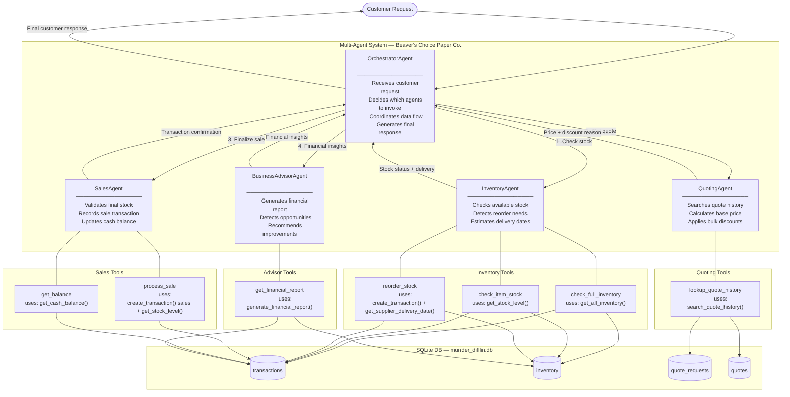

# Beaver's Choice Paper Company — Multi-Agent System Diagram

```mermaid
flowchart TD
    Customer([Customer Request]) --> Orch

    subgraph AGENTS["Multi-Agent System — Beaver's Choice Paper Co."]

        Orch["OrchestratorAgent
        ─────────────────
        Receives customer request
        Decides which agents to invoke
        Coordinates data flow
        Generates final response"]

        Inv["InventoryAgent
        ─────────────────
        Checks available stock
        Detects reorder needs
        Estimates delivery dates"]

        Quote["QuotingAgent
        ─────────────────
        Searches quote history
        Calculates base price
        Applies bulk discounts"]

        Sales["SalesAgent
        ─────────────────
        Validates final stock
        Records sale transaction
        Updates cash balance"]

        Advisor["BusinessAdvisorAgent
        ─────────────────
        Generates financial report
        Detects opportunities
        Recommends improvements"]

    end

    subgraph TOOLS_INV["Inventory Tools"]
        T1["check_full_inventory
        uses: get_all_inventory()"]
        T2["check_item_stock
        uses: get_stock_level()"]
        T3["reorder_stock
        uses: create_transaction() + get_supplier_delivery_date()"]
    end

    subgraph TOOLS_QUOTE["Quoting Tools"]
        T4["lookup_quote_history
        uses: search_quote_history()"]
    end

    subgraph TOOLS_SALES["Sales Tools"]
        T5["process_sale
        uses: create_transaction() sales + get_stock_level()"]
        T6["get_balance
        uses: get_cash_balance()"]
    end

    subgraph TOOLS_ADV["Advisor Tools"]
        T7["get_financial_report
        uses: generate_financial_report()"]
    end

    subgraph DB["SQLite DB — munder_difflin.db"]
        DB1[(transactions)]
        DB2[(inventory)]
        DB3[(quote_requests)]
        DB4[(quotes)]
    end

    Orch -->|"1. Check stock"| Inv
    Orch -->|"2. Get quote"| Quote
    Orch -->|"3. Finalize sale"| Sales
    Orch -->|"4. Financial insights"| Advisor

    Inv --- T1 & T2 & T3
    Quote --- T4
    Sales --- T5 & T6
    Advisor --- T7

    T1 & T2 & T3 --> DB1 & DB2
    T4 --> DB3 & DB4
    T5 & T6 --> DB1
    T7 --> DB1 & DB2

    Inv -->|"Stock status + delivery"| Orch
    Quote -->|"Price + discount reason"| Orch
    Sales -->|"Transaction confirmation"| Orch
    Advisor -->|"Financial insights"| Orch

    Orch -->|"Final customer response"| Customer
```
